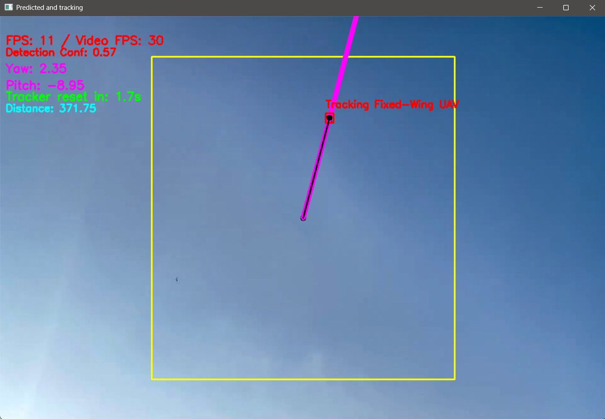

# Fixed-Wing UAV Detection & Tracking 

## Description  
This project implements detection and tracking of fixed-wing unmanned aerial vehicles (UAVs) in video footage. A single-class detection model (`fixed-wing-UAV`) is employed to locate UAVs, followed by tracking using OpenCV’s CSRT (Channel and Spatial Reliability Tracker) algorithm. The system also computes yaw and pitch angles based on the object’s position relative to the image center.

## Team  
- Umut ŞUATAMAN – Computer Engineer  
- Açelya YILDIRIM – Computer Engineer    
- Ayşenur GÜLSÜM– Computer Engineer    

## Features  
- Real-time or recorded video input for fixed-wing UAV detection  
- CSRT-based object tracking after detection  
- Visualization of yaw and pitch angles via a vector overlay  
- Display of distance from image center and tracking confidence  
- FPS calculation and frame region constraint for stable tracking  

## Getting Started  

### Prerequisites  
- Python 3.x  
- OpenCV (`opencv-python`)  
- NumPy  
- Ultralytics YOLO library  
- (Optional) time, math modules (built-in)  

```bash
pip install opencv-python numpy ultralytics
```

## Installation & Usage

1. Clone the repository:

```bash
git clone https://github.com/suataman/Fixed-Wing-UAV-Detection-Tracking.git
```

2. Place your trained model into the models/ directory (e.g. models/model.pt).

**Note**: The model file (.pt extension) included here—e.g. models/model.pt—has been trained on our custom dataset of fixed-wing UAVs. You are encouraged to retrain or fine-tune this model on your own dataset to achieve even better results, as performance will depend heavily on dataset size, diversity, augmentation strategy and hyper-parameter tuning.

3. Insert your test video into the videos/ folder or configure webcam input.

4. Run the main script:
```bash
python main.py
```
**Press q to exit the video display.**

## Example Output



## Configuration / Parameter Description
- `timeout = 5` → time in seconds to reset tracker if no detection

- `yaw_factor`, `pitch_factor` → scaling factors for yaw and pitch angle calculation

- `rect_width`, `rect_height` → proportions of the central region (e.g., 50% width, 80% height) used for

## License

This project is licensed under the MIT License © 2025 Umut Şuataman, Açelya Yıldırım, Ayşenur Gülsüm

## Contact

[Linkedin](https://www.linkedin.com/in/umutsuataman/)
